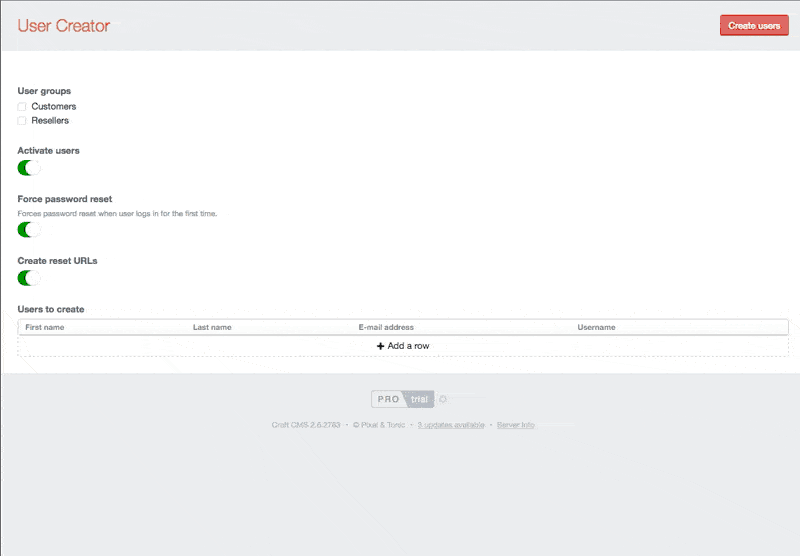

# User Creator plugin for Craft CMS

Allow you to generate users en masse, simply.

## Installation

To install User Creator, follow these steps:

1. Download & unzip the file and place the `usercreator` directory into your `craft/plugins` directory
2.  -OR- do a `git clone https://github.com/sjelfull/usercreator.git` directly into your `craft/plugins` folder.  You can then update it with `git pull`
3. Install plugin in the Craft Control Panel under Settings > Plugins
4. The plugin folder should be named `usercreator` for Craft to see it.  GitHub recently started appending `-master` (the branch name) to the name of the folder for zip file downloads.

User Creator works on Craft 2.4.x and Craft 2.5.x.

## Roadmap

* Create users from uploaded CSV/JSON
* Add plugin permissions

## User Creator Changelog

### 0.0.1 -- 2016.05.03

* Initial release

Brought to you by [Fred Carlsen](http://sjelfull.no)